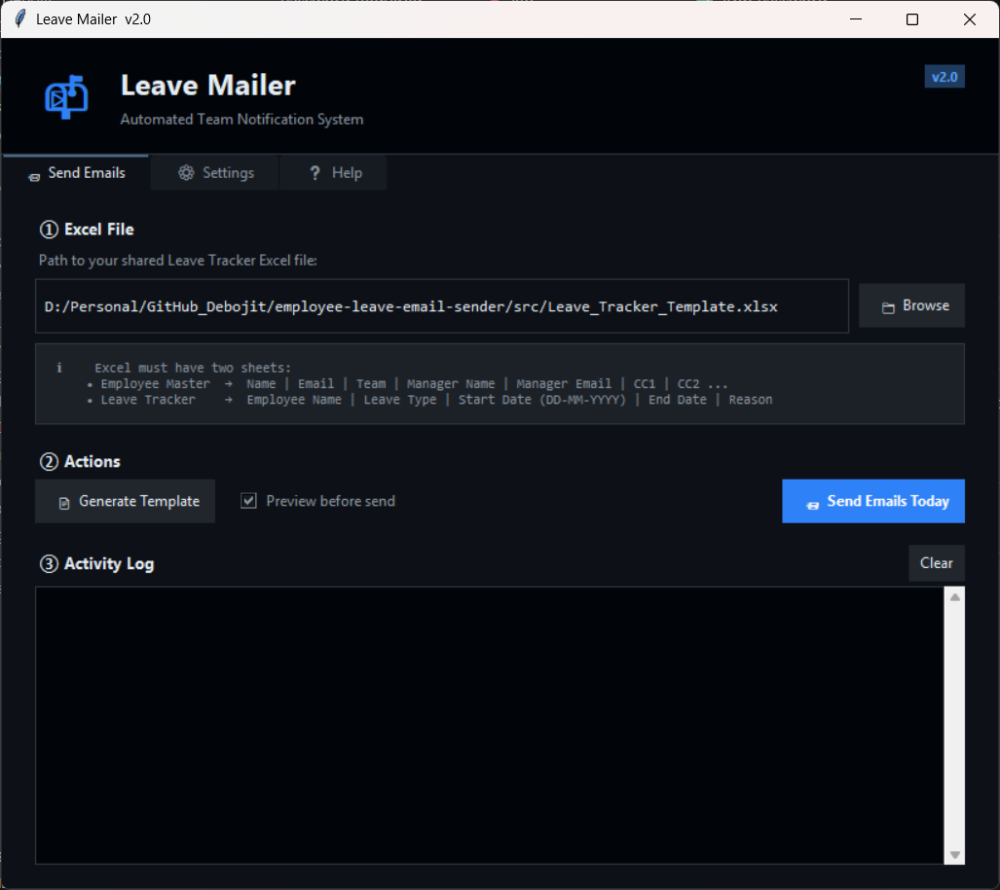
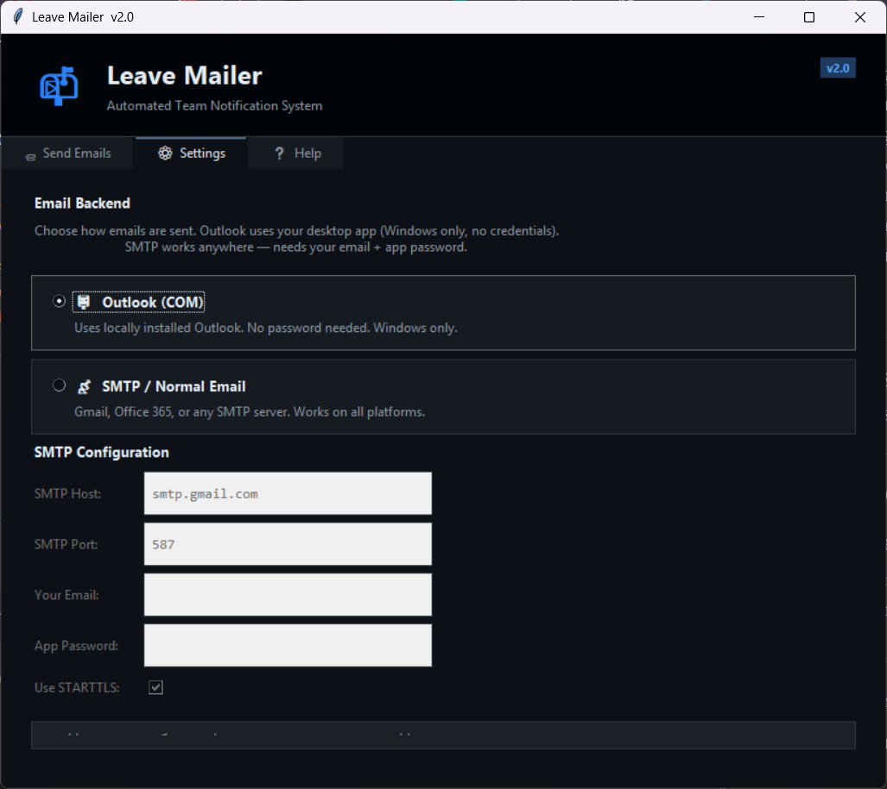
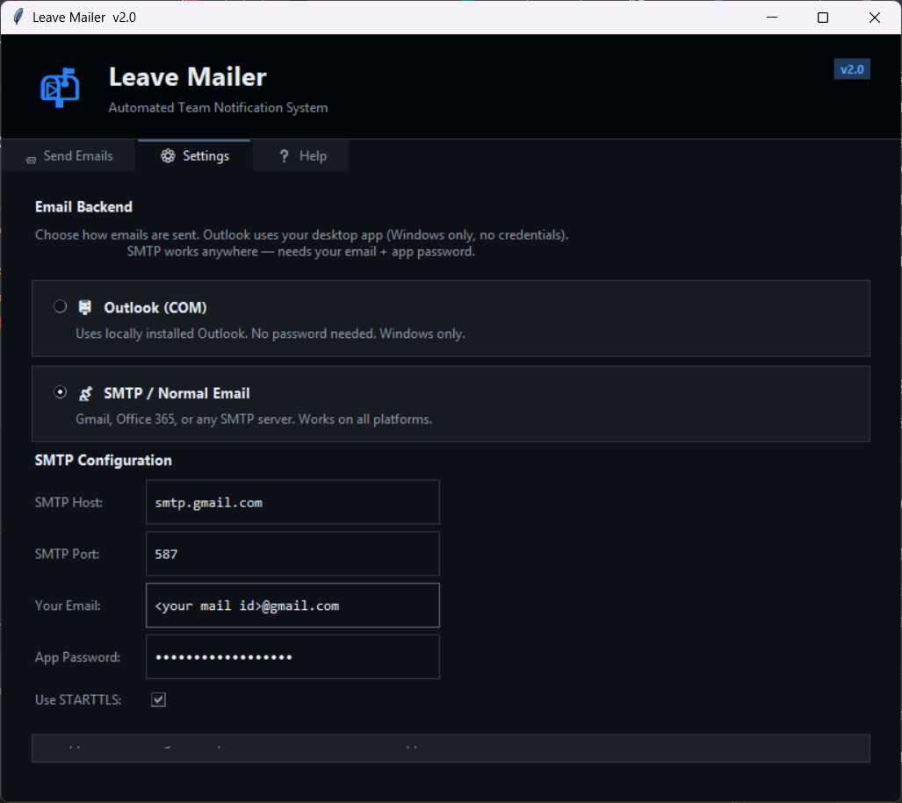
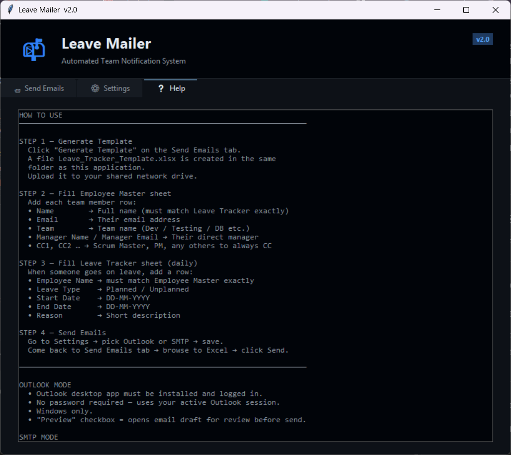
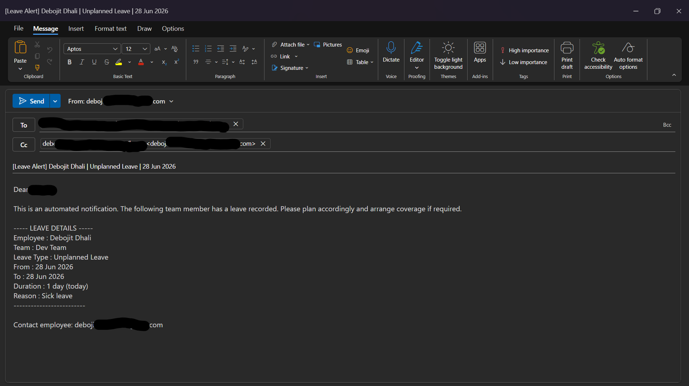
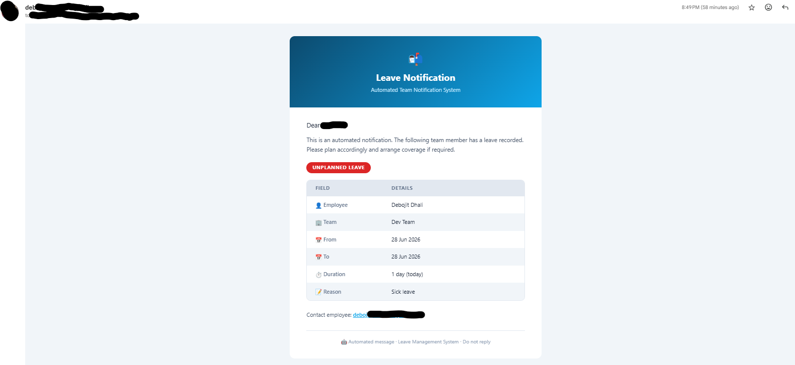

<div align="center">

# 📬 Employee Leave Email Sender

### Desktop Automation Tool for Automated Leave Notifications Using Python and Tkinter


</div>

---

# 📌 Project Overview

This project is a desktop automation tool developed to solve a real problem I faced while working as an **Automation Lead at Tata Consultancy Services (TCS)**.

Managing leave notifications manually across a team of 40+ people spread across multiple sub-teams — Dev, Testing, DB, and others — was time-consuming and error-prone. Each person has their own hierarchy. Some report to different leads. Some require different stakeholders to be notified.

I built **Employee Leave Email Sender** to automate this completely.

The application reads a shared Excel workbook, identifies employees who are on leave today, and automatically sends personalized leave notification emails to the correct reporting manager — with dynamic CC support for each employee individually.

---

# 🎯 Objectives

* Eliminate manual effort in sending daily leave notification emails
* Support hierarchical notification — each person has their own manager and CC list
* Provide two email delivery options for flexibility in corporate environments
* Ship as a standalone `.exe` requiring zero installs on the target machine
* Allow any team member to update the shared Excel without any technical knowledge

---

# 📁 Repository Structure

```bash
employee-leave-email-sender/
│
├── src/
│   ├── leave_mailer.py          ← Application entry point (GUI)
│   ├── excel_reader.py          ← Excel parsing and data model
│   ├── email_sender.py          ← Email backends (Default Client + SMTP)
│   └── template_generator.py   ← Excel template generator
│
├── assets/
│   └── screenshots/
│       ├── main-window.png
│       ├── settings-tab.png
│       ├── help-tab.png
│       ├── email-preview.png
│       └── ...
│
├── docs/
│   └── USAGE.md
│
├── requirements.txt
├── README.md
├── .gitignore
└── LICENSE
```

---

# 🛠️ Technologies Used

| Technology | Purpose |
|---|---|
| Python 3.8+ | Core programming language |
| Tkinter | Desktop GUI framework |
| pandas | Excel data reading and processing |
| openpyxl | Excel file creation and styling |
| smtplib / ssl | SMTP email sending |
| webbrowser / urllib | Default mail client draft opener |
| PyInstaller | Packaging to standalone `.exe` |
| JSON | Settings persistence |

---

# 📐 Excel Workbook Structure

The application expects an Excel workbook with two worksheets.

---

## Sheet 1 — Employee Master

This sheet stores the complete employee directory with reporting hierarchy.

| Column | Description |
|---|---|
| Name | Employee full name |
| Email | Employee email address |
| Team | Team or department |
| Manager Name | Reporting manager name |
| Manager Email | Reporting manager email address |
| CC1 | Optional CC recipient |
| CC2 | Optional CC recipient |
| CC3 | Optional CC recipient |

> **Important:** The employee name must exactly match the name in the **Leave Tracker** sheet.

---

## Sheet 2 — Leave Tracker

This sheet stores daily leave records updated by team members.

| Column | Description |
|---|---|
| Employee Name | Employee name |
| Leave Type | Planned / Unplanned |
| Start Date | Leave start date (DD-MM-YYYY) |
| End Date | Leave end date (DD-MM-YYYY) |
| Reason | Reason for leave |

---

# ✨ Features

* 📮 **Dual email backend** — Default mail client (draft opener) or full SMTP background send
* 👥 **Dynamic CC per employee** — CC1, CC2, CC3 columns let each employee have a unique CC list
* 📊 **Excel-driven workflow** — Shared file anyone can edit, no database or technical knowledge needed
* 📄 **One-click template generator** — Creates the correctly structured Excel instantly
* 🎨 **Rich HTML emails** — Colour-coded Planned / Unplanned badges with clean table layout
* 💾 **Settings persistence** — SMTP configuration is saved between sessions
* 🖥️ **Standalone EXE** — Packaged with PyInstaller, no Python required on target machine
* 🧵 **Non-blocking UI** — Email sending runs in a background thread so the GUI stays responsive

---

# 📧 Email Backend Comparison

| Feature | Default Mail Client | SMTP (Background Send) |
|---|---|---|
| Password Required | ❌ No | ✅ App Password |
| Email Review | ✅ Opens Draft | ❌ Sends Immediately |
| HTML Email Support | ❌ Plain Text | ✅ Rich HTML |
| Cross Platform | Depends on Default App | ✅ Yes |
| Silent Background Send | ❌ No | ✅ Yes |
| Best Use Case | Manual Review | Fully Automated Workflow |

---

# 📸 Screenshots

## 📨 Main Window — Send Emails Tab

Browse to the shared Excel file, generate the template, and trigger email notifications for all employees on leave today.



---

## ⚙️ Settings Tab

Choose between Default Mail Client and SMTP. Configure SMTP host, port, credentials, and TLS settings. Settings persist between sessions.



---

## ❓ Help Tab

Step-by-step usage guide and troubleshooting tips built directly into the application.



---

## 📩 Email Preview

Rich HTML email opened as a draft for review before sending.



Rich HTML email after sending (SMTP).



---

# 🚀 How to Run

## 1️⃣ Clone Repository

```bash
git clone https://github.com/CoderDebojit/employee-leave-email-sender.git
```

---

## 2️⃣ Navigate to Source Folder

```bash
cd employee-leave-email-sender/src
```

---

## 3️⃣ Install Dependencies

```bash
pip install -r requirements.txt
```

---

## 4️⃣ Run the Application

```bash
python leave_mailer.py
```

---

# 🛠️ Build Standalone EXE

```bash
cd src
pyinstaller --onefile --windowed --name "LeaveMailer" leave_mailer.py
```

The generated executable will be inside the `dist/` folder.

Distribute only `LeaveMailer.exe` — the receiving machine needs nothing installed except a working email client or SMTP credentials.

---

# 📦 Requirements

```text
pandas>=2.0.0
openpyxl>=3.1.0
pyinstaller>=6.0.0
```

Install all at once:

```bash
pip install -r requirements.txt
```

---

# 🔐 Gmail SMTP Setup

1. Enable Two-Factor Authentication on your Google Account
2. Open Google Account → Security → App Passwords
3. Generate a new App Password for Mail
4. Use that password in the Settings tab

```text
SMTP Host : smtp.gmail.com
Port      : 587
TLS       : Enabled
```

For Office 365:

```text
SMTP Host : smtp.office365.com
Port      : 587
TLS       : Enabled
```

---

# ⚠️ Known Risks and Limitations

| Risk | Mitigation |
|---|---|
| Excel file locked by another user | Ask the team to close the file before triggering emails |
| Name mismatch between sheets | Names in Leave Tracker must match Employee Master exactly |
| SMTP authentication failure | Use App Password, not the main account password |
| Antivirus false positive on EXE | Whitelist the EXE in Windows Defender |
| Default mail client not configured | Set up a default mail application on Windows |

---

# 🔮 Future Improvements

* Web-based leave submission form using Flask or FastAPI
* Windows Task Scheduler integration for daily auto-trigger
* Email open and delivery tracking
* Leave balance tracking per employee
* Calendar integration with Google Calendar or Outlook Calendar
* Support for leave approval workflow

---

# 📈 Learning Outcomes

Through building this project, I gained practical experience in:

* Building production-quality desktop applications using Python and Tkinter
* Designing modular, maintainable Python codebases
* Working with Excel automation using pandas and openpyxl
* Implementing dual email backends with a unified interface
* Packaging Python applications as standalone executables using PyInstaller
* Handling threading in GUI applications to keep the UI responsive
* Designing settings persistence using JSON
* Writing real-world automation tools from scratch

---

# 📜 License

This project is licensed under the MIT License.

---

# 👨‍💻 Author

## Debojit Dhali

* GitHub: https://github.com/CoderDebojit
* LinkedIn: https://www.linkedin.com/in/debojit-dhali-bb7726171/

---

<div align="center">

### ⭐ If you found this project useful, consider giving it a star!

</div>